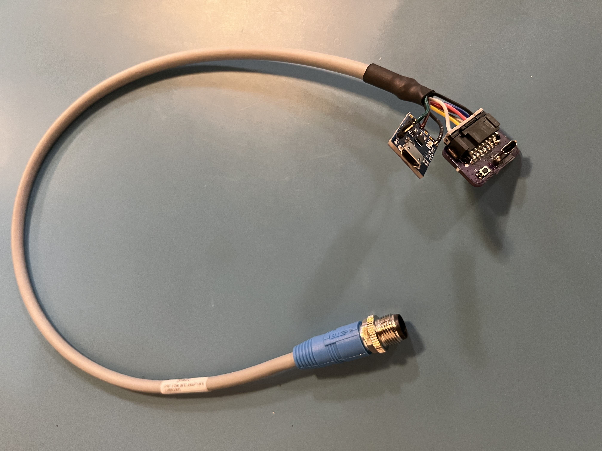

# farm-ng Debug Cable

## Overview

Cable used to update and debug farm-ng products. It includes rest functionality along with USB and serial communication. 

### Product specific uses

#### Dash

- USB interface is for REPL, fileystem access as well as updating firmware and applications,
- Serial interface is not used at the moment
- Reset is connected to the Microcontroller reset and used for hard reset. It also can be double pressed to force bootloader mode. 

**See update process documentation for more information**

#### Brain

- USB interface is used for connecting for lashing images
- Serial interface is used for operating system terminal
- Reset / Flash button is used for enabling the firmware update mode (press on boot)

**See flashing and operating system documentation for more information**

## Pinout

Connector M12-8 A code female used to connect to farm-ng products. The debug cable connects the IO to two MicroUSB connectors and a reset button. 

Debug wire colors based on common cable with flying leads used on farm-ng built debug kits. 

| PIN  | Description   | Typical Wire Color | Notes                      |
| ---- | ------------- | ------------------ | -------------------------- |
| 1    | RESET         | White              |                            |
| 2    | TTL RX (3.3v) | Brown              | Connect to TX of interface |
| 3    | TTL TX (3.3v) | Green              | Connect to RX of interface |
| 4    | USB D-        | Yellow             |                            |
| 5    | UDB D+        | Gray               |                            |
| 6    | USB VBUS      | Pink               |                            |
| 7    | NC            | Blue               |                            |
| 8    | GND           |                    |                            |

