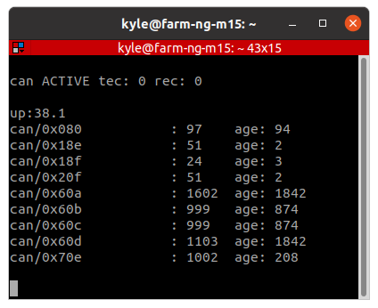

# Cansniffer

This example covers a simple tool for listening to all CAN Id's streaming on the bus
and measure simple statistics about the streamed messages.
The example is inspired by the
[cansniffer command line tool from can-utils](https://manpages.debian.org/testing/can-utils/cansniffer.1.en.html).

You should read through the [hello MainLoop](/examples/hello_main_loop/README.md) example before this.

Last Update: 2022-08-26


## Parts required:

- [farm-ng microcontroller kit](https://farm-ng.com/products/microcontroller-kit) (w/ USB-C cable)

## CansnifferApp Breakdown

Here we create `CansnifferApp` as a very simple example of the types of `AppClass` you can create.

In our app, we create a `TickRepeater` that will cause our print statements to execute every 1000 ms (every second).
In those print statements (in `CansnifferApp.iter()`), we first clear the console with:
```Python
print("\033[2J", end="")
```
then print metrics about the CAN bus that are already measured by default in `MainLoop`, returned by the `debug_str()` method.
```Python
print(self.main_loop.debug_str())
```
These statistics include transmission and receive CAN errors,
as well as all CAN Id's received by the microcontroller's CAN interface, with statistics on the time between received messages for each CAN Id.

> Take it further:
>
> You could also add memory statistics to the printed lines
> by adding the following line to the `CansnifferApp` constructor:
> ```Python
> self.main_loop.show_mem = True
> ```

## Instructions

> *NOTE:* Steps 1 - 3 are explained in greater detail in the [hello MainLoop](/examples/hello_main_loop/README.md) introductory example.

1. Connect your microcontroller as in the following diagram:
2. Drop the `code.py` file and the `lib/` folder directly into the root of the mounted CIRCUITPY drive.
3. Open the serial console.
4. You should now see the can statistics printed and updated every 1000 ms.
> If the serial console is blank, click into the serial console and soft reboot the microcontroller with `ctrl+D` .

<!--  -->
<p align="center">

</p>
