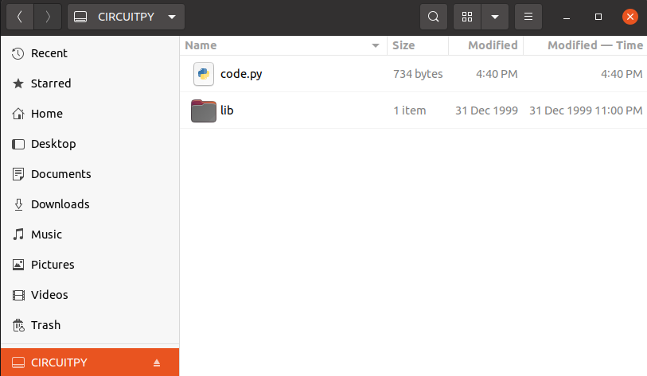

# Hello Main Loop Example

This introductory example covers getting set up, interacting with the Amiga, and
using auto-control mode to drive your Amiga from a computer
using the [farm-ng microcontroller Kit](https://farm-ng.com/products/microcontroller-kit).

This example enables driving the Amiga by entering simple fwd / rev / left / right keyboard commands the serial port, which the app sends over the CAN bus.

## Parts required:

- [farm-ng microcontroller kit](https://farm-ng.com/products/microcontroller-kit) (w/ USB-C cable)

## Code Breakdown

### Imports from `lib/`

#### `MainLoop`

The `MainLoop` class is used throughout the application layer of the farm-ng firmware.
`MainLoop` contains generic functionality we use on our pendant, dashboard, and auxiliary components for constant looping, receiving of CAN messages, sending of regular status updates called `Heartbeats`, and more.
The `MainLoop` takes an `AppClass` in the constructor, and the `AppClass` is expected to contain a method called `iter` that is called every in every iteration (also called `iter`) of the `MainLoop`.

#### `TickRepeater`

The `TickRepeater` class is a useful utility that we recommend taking advantage of throughout your custom implementations.
We use "repeaters" to limit the frequency of certain actions, by only performing the action once the `period` of the repeater has past, when compared to the last time the action was performed.
The `check()` method returns `False` until the checkpoint has past, and `True` once the checkpoint is past.
When `True` is returned, the repeater is updated to the next checkpoint, so you really only need the `check()` method in most applications.

The `TickRepeater` is what we call a "catch-up" repeater, in which the the next checkpoint is the `ticks_period_ms` (period in ms) added to the last checkpoint (rather than the next checkpoint being the `ticks_period_ms` added to the time of last execution).
As you can infer, there's no reason to use one of these catch-up repeaters if the `check()` will be called less frequently than the `ticks_period_ms` used in the constructor.

> `ticks_ms` _NOTE_:
>
> We use `ticks_ms`
> which wraps every `2^29` ms (~6.2 days).
> Our logic handles a single wrap, but we do not detect two wraps
> as we use this in periods more on the `100 ms` timescale.
> If you are creating a long duration application,
> just make sure your period is less than 6 days and that the check
> is called at least that often.
>
> See the [`supervisor.ticks_ms()` docs](https://docs.circuitpython.org/en/latest/shared-bindings/supervisor/#supervisor.ticks_ms)
> for more details about `ticks_ms`.

### code.py

> code.py (or main.py) is the default name for the executable Python file on microcontrollers flashed with CircuitPython.
> You'll see we stick to the code.py convention with our files.

#### HelloMainLoopApp

Here we create `HelloMainLoopApp` as a simple example of the types of `AppClass` you can create.

In our app, we create a `TickRepeater` that will cause ...

## Instructions

1. Connect your microcontroller as in the following diagram:

2. Drop the `code.py` file and the `lib/` folder directly into the root of the mounted CIRCUITPY drive, as seen below.

3. Open the serial console.

> Mu is the recommended serial console program by adafruit on their [CircuitPython serial console page](https://learn.adafruit.com/welcome-to-circuitpython/kattni-connecting-to-the-serial-console).
> Mu has a built in plotter for tuples printed to the serial console (print statements on your microcontroller).
>
> We've found that Mu can be a little unstable and freezes occasionally,
> so we'd recommend checking out their links for the "advanced" serial console:
>
> - [Windows serial console](https://learn.adafruit.com/welcome-to-circuitpython/advanced-serial-console-on-windows)
> - [Linux serial console](https://learn.adafruit.com/welcome-to-circuitpython/advanced-serial-console-on-linux)
> - [Mac serial console](https://learn.adafruit.com/welcome-to-circuitpython/advanced-serial-console-on-mac-and-linux)

4. ...