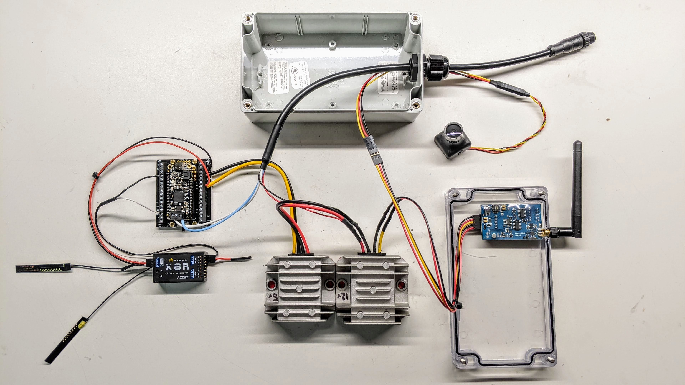

# Overview of the Amiga Development Kit

The [Amiga Development Kit](https://farm-ng.com/products/microcontroller-kit)
is the best option for hackers to get started with building custom
applications for their Amiga robot.

We have a contantly exapanding library of thorough examples, covering software and hardware,
to provide guidance and inspiration for your next project!

#### Check out the  [farm-ng/amiga-dev-kit Github](https://github.com/farm-ng/amiga-dev-kit)
