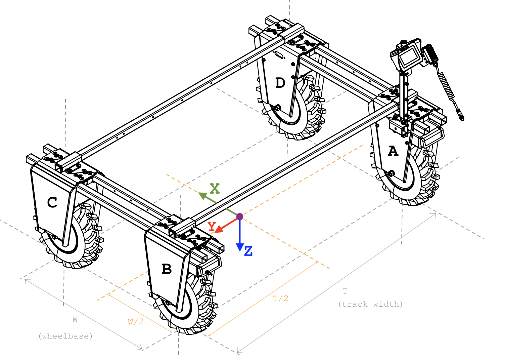

# Launcher Guide

The Launcher is the first page you will see after your Amiga Brain has completed its booting process.
From here you can open various Apps and dive deeper into Settings.

## Status Bar

The status bar provides critical information for robot operation.

- **Record**: Button used to Start and Stop recording. Recordings are saved in the [**File Manager App**](/docs/apps/file_manager_app/)
- **CPU**: Percentage processing power being used across all cores.
- **Memory**: Percentage of available RAM being used.
- **Tack**: When working in [**Autoplot**](/docs/apps/autoplot_app), this icon will show up
once a track has been loaded.
- **Auto**: This icon confirms the robot is in [**Auto Control**](/docs/dashboard/dashboard-user-guide#auto-control),
a prerequisite for autonomous tasks.
- **Filter**: This indicates the status of the [**UKF filter**](/docs/concepts/filter_service/).
Autonomy will not engage if the filter has not converged.
- **GPS**: A visual indicator showing if the [**GPS Service**](/docs/concepts/gps_service/)
is active and functional.
- **WiFi**: This icon shows you if the robot is connected to Wifi, a requirement for autonomous operations.
- **Battery**: Displays the current battery level.
Always monitor this, especially before starting long tasks.
- **E-Stopped**: This icon will show up whenever the E-stop button on your Amiga is engaged.

## Apps

Please visit the following links for an in-depth exploration of the [**Autoplot**](/docs/apps/autoplot_app),
[**Camera**](/docs/apps/camera_app), and [**File Manager**](/docs/apps/file_manager_app) Apps.

## Settings

The Settings menu allows you to make in depth adjustments to the various systems of your Amiga.

### About

This section presents useful information such as your Robot's Name, Software Version, and Apps.

You can open a terminal window on this page for debugging while you are not at your computer.
To begin typing, you can either click on the "Show Keyboard" icon or connect a keyboard to
the USB port on the back of the Robot's Brain.

### WiFi

The WiFi Manager allows you to choose the network you want to connect to. Once you select a network
and fill out all the necessary fields, your WiFi connection will be established.

:::tip Network Connections
You may disable WiFi on the robot for network tests, making it easy to control and troubleshoot its functions.
It will help you ensure the robot operates correctly under different network conditions.
:::

### Services

For an in depth exploration of the Amiga Services, check out these [**overviews**](/docs/concepts/canbus_service/).
By default services will be active, but you may cycle them on/off to troubleshoot their functions.

### Recorder

The Recorder is the backbone of the Amiga's data logging and playback functionality.
It is designed to capture and store raw data from various robot
[**services**](/docs/concepts/canbus_service/) and
[**topics**](/docs/concepts/recorder_service/#available-topics-for-recording),
facilitating later analysis, debugging, and model training.

**With OS 2.3.1 comes Recorder Profiles.**

Users can now create multiple profiles to record from, allowing the flexibility to swap which
topics get recorded, without having to overwrite previously saved configurations.

To get started, click **"New Profile"**, enter a name, and click **"Save Profile"**.
This is now the currently selected profile.  

*(As of release 2.3.1 you must create a profile in order to save topics.
Attempting to save topics without a current profile will prompt the profile creation flow)*

To edit a profile, simply make changes to it while it is active, and click **"Save Topics"**.

Create subsequent profiles with the same flow, beginning with clicking **"New Profile"**.
Newly created profiles automatically become the active profile.

The black badge in the top left indicates the active profile, if one exists.
Click this badge to see and manage all existing profiles.
To set a profile as active, simply click on it.

Click the "X" inside the list item to delete a profile.

Recording will use the topics of the currently active profile.
Clicking the record button without a profile, or without any topics selected will record all topics.

### Robot Geometry

Fine-tuning your Amiga's geometry is key to seamless autonomous operation.
Begin all measurements from the **center or the robot** (in length & width) at ground level.

- **Positive X** values are located **ahead of center**
- **Negative X** values are located **behind center**

- **Positive Y** values are located **left-side** of **center**
- **Negative Y** values are located on the **right-side** of **center**

:::info
The **GPS** value is taken from the center of the antenna, while the **IMU** value comes from OAK 0.
:::

To determine the **wheelbase** and **track width** of your Amiga, see the illustration below.

### Robot Localization

The modifiable parameters in the `Robot Localization` tab will directly interact with the
[**Autoplot App**](/docs/apps/autoplot_app) and how your robot drives autonomously.

#### Breadcrumb Spacing

- Sets the distance between waypoints when a `Track` is recorded.
Decreasing this value improves navigation accuracy by creating a more detailed path but may slow
down the robot due to increased computational demands.
Increasing the spacing speeds up movement but at the cost of precision.

#### Path Deviation Threshold

- Determines the maximum allowable deviation  from the planned path before the robot is
considered off-track, which will cancel the track following task.
A lower threshold ensures the robot is always close to the path, preventing it from entering
unwanted regions.
A higher threshold allows the track following to resume if for some reason the robot is far away from
the track, but at the cost of path adherence.

#### Minimum State Estimation and Heading Accuracy

- Dictates the minimal acceptable levels of accuracy for the robot's position and orientation estimations.
Higher thresholds will prevent the filter to diverge, but at the cost of precision state estimation,
which is crucial for autonomous driving.

#### Minimum GPS Accuracy

- Specifies the lowest acceptable GPS signal accuracy.
Poor GPS accuracy can significantly affect the stability and reliability of the navigation filter,
leading to potential divergences.

#### Divergence Delay

- Defines the duration the robot's system will wait, considering all the aforementioned factors, before
determining that the navigation filter has diverged.
This setting is crucial for managing the balance between responsive corrections and filter stability.

#### Gyroscope and GPS Stale Thresholds

- These thresholds determine how long the robot waits before considering data from the gyroscope or
GPS as outdated ('stale').
Stale data can cause the navigation filter to diverge, impacting robot localization.

### IMU Calibration

Calibrating the Inertial Measurement Unit (IMU) corrects any sensor biases and is essential for
precise navigation.
Carry out this process when setting up your Amiga for the first time or after making any
 changes to the Robot's geometry.

If your Amiga has been calibrated you will see the date/time when this process was last performed
along with a green tab that reads Calibrated.

If you need to calibrate your Amiga, place it on flat ground and press the
 **Start Calibration** button. Hit **Confirm**

The Calibration will begin and a green bar will move across the screen as the process is completed.

Once the Calibration process is complete you will be returned to the initial screen page and a new
date/time stamp will appear reflecting the latest Calibration performed.

### PoE Switch

The PoE Switch Manager offers network diagnostic capabilities, including the ability to detect
potential cabling issues via remote ping.
This is specially useful when your Oak devices might be down.
It gives you per port functionality to enable/disable PoE connected devices.

You can also reset your PoE Switch from this tab.

:::warning
Resetting the PoE switch will affect all connected devices.
:::

### GPS NTRIP

The Setup ntrip menu is where you will input your base station's credentials.

- **Server Name**: The server address of the base station.
This could be an IP address (e.g., 192.168.1.1) or a url (e.g., myrtkservice.com)

- **Mountpoint**: Specific mount point on the ntrip server.

- **Port**: The port used by the ntrip server.

- **User**: Username for accessing the base station.

- **Password**: Corresponding password for the above username.

- **Serial Interface**: This is the USB port to which your GPS module is physically connected.
Unless you need to open the brain and modify its port (strongly not recommended), leave this field
untouched.

:::caution Virtual Reference Station (vrs) not supported
Current AmigaOS GPS service assumes a static base station. If you are using a service that provide
RTK corrections referent to a VRS (Virtual Reference Station), your GPS service will recognize it,
but coordinates will experience significant offset after every reboot.
:::

:::tip
For California users, [**CRTN**](http://sopac-csrc.ucsd.edu/index.php/crtn/) offers free
access to base stations across the state.
Other states or regions may have similar services available.
Always check local resources for the best positioning support in your area.
:::

### Track Following

#### Lookahead Distance

- Represents how far ahead the robot looks to anticipate and prepare for path changes.
It's essential for enabling the robot to smoothly and efficiently navigate bends and turns.
The distance should be tuned based on the robot's speed and the complexity of the path.

#### Linear Speed

- Controls the maximum linear speed of the robot as well as the proportional gain in the PID controller
for linear movement.
Higher speeds increase the distance covered in less time but may reduce reaction time to path changes.

#### Angular Speed

- Governs the maximum angular velocity and the gains in the PID controller (proportional, integral, derivative)
for turning.
Tuning these values ensures that turns are handled smoothly and with appropriate responsiveness.

#### Turn in Place

- Adjusts the proportional and derivative gains specifically for scenarios where the robot needs to
turn while stationary.
