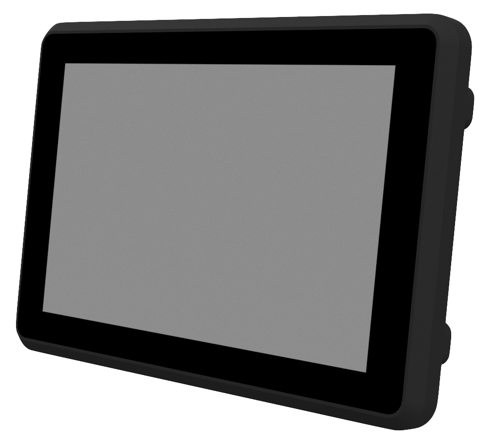
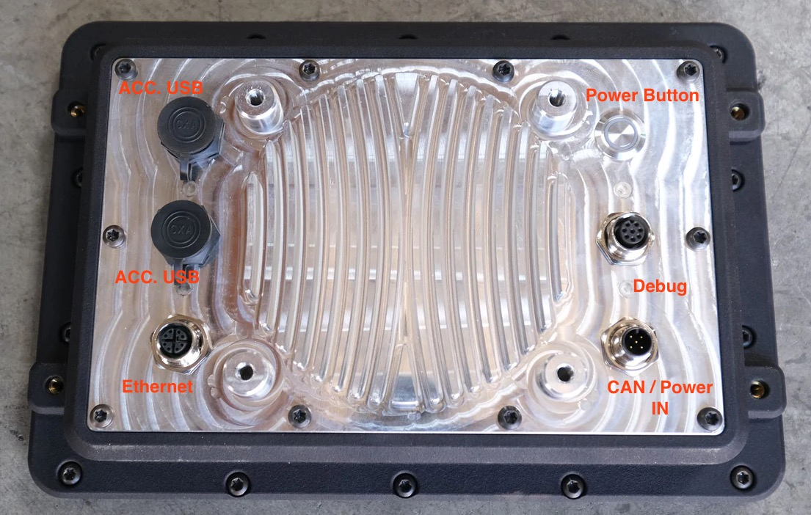

# farm-ng Brain

<!--  -->

### [Brain product page](https://farm-ng.com/products/brain)

## Brain overview video
<iframe width="560" height="315" src="https://www.youtube.com/embed/_p0I11p4QF4" title="YouTube video player" frameborder="0" allow="accelerometer; autoplay; clipboard-write; encrypted-media; gyroscope; picture-in-picture; web-share" allowfullscreen></iframe>

## Features overview

**The farm-ng Brain is an Alpha level product subject to change. Not all features are fully tested and validated.**

The farm-ng Brain brings supercomputer performance to the edge, in a ruggedized packaged designed for the harshest environments.
The Brain contains a NVIDIA Xavier NX which has up to 21 TOPS of hardware accelerated computing power for machine learning and AI applications, and paired it with a touch-screen display designed to be outdoor-visible, creating both a user-interface and sensor hub in a single, waterproof package.
This provides quick entry into the world of artificial intelligence, and a single packaged solution for developing tools and interfaces for outdoor autonomy.

Includes CAN bus, USB, and GIGe ethernet bus options.

### Brain assembly

| Specifications       |                                                                                                                                           |
| -------------------- | ----------------------------------------------------------------------------------------------------------------------------------------- |
| Input power          | 12/24 volts (9-28vdc)                                                                                                                     |
| Power consumption    |                                                                                                                                           |
| Screen               | 10.1" High brightness (850cd/m2) optically bonded IPS display, 1280x800 resolution                                                        |
| Touch                | Industrial capacitive touch screen controller, tunable for gloves and wet environment (Tuning requires customization). Multitouch capable |
| Environmental rating | IP64 (As of this design iteration)                                                                                                        |
| USB                  | 2x USB 3.0 (Limited by MicroUSB connectors), Debug connector contains USB for firmware and serial terminal.                               |
| Network              | 1 x M12-8 with 1Gb ethernet capability. Built in WiFi.                                                                                    |

### Xavier computer

| Specifications |                                          |     |
| -------------- | ---------------------------------------- | --- |
| CPU            | 6-core 64-bit CPU, NVIDIA Carmel ARMv8.2 |     |
| GPU            | 384-core NVIDIA Volta GPU                |     |
| Memory         | 8 GB 128-bit LPDDR4x 59.7GB/s            |     |
| WiFi           | Integrated WiFi with OS drivers          |     |
|                |                                          |     |

## Connections

<!--  -->

Xavier provides the following connectors and button for IO

- Power button is used for powering up and down the embedded computer
- Debug is for interacting and updating with the OS (See information on debug connector)
- CAN / Power connector provides 12/24 volts and CAN interface
- ACC USBs are two accessory USBs (as of the early version of the display are USB 2.0 Micro USB connectors) that allow attaching USB devices
- Ethernet X coded M12 ethernet connection

### Pinouts

### CAN/Power Input

Mating connector M12-5 A code female

| PIN | Description   | Typical Wire Color | Notes                                                        |
| --- | ------------- | ------------------ | ------------------------------------------------------------ |
| 1   | Shield        | Bare/Green         | Should only be grounded at one end                           |
| 2   | Supply +24vdc | Red                | farm-ng uses 24v                                             |
| 3   | GND           | Black              |                                                              |
| 4   | CAN_High      | White              | Needs at least one termination, and two devices to function. |
| 5   | CAN_Low       | Blue               | Needs at least one termination, and two devices to function. |

### Debug

**SEE INFORMATION ON DEBUG CABLE**

Mating connector M12-8 A code female

Debug wire colors based on common cable with flying leads used on farm-ng built debug kits.

| PIN | Description   | Typical Wire Color | Notes                      |
| --- | ------------- | ------------------ | -------------------------- |
| 1   | RESET         | White              |                            |
| 2   | TTL RX (3.3v) | Brown              | Connect to TX of interface |
| 3   | TTL TX (3.3v) | Green              | Connect to RX of interface |
| 4   | USB D-        | Yellow             |                            |
| 5   | UDB D+        | Gray               |                            |
| 6   | USB VBUS      | Pink               |                            |
| 7   | NC            | Blue               |                            |
| 8   | GND           | Black              |                            |
