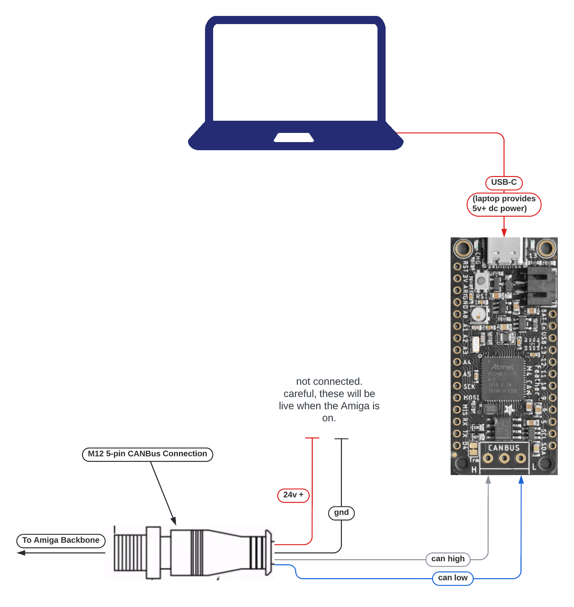
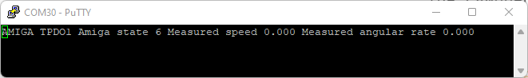

# Hello Main Loop Example

This introductory example covers getting set up, interacting with the Amiga, and
using auto-control mode to drive your Amiga from a computer
using the [farm-ng microcontroller Kit](https://farm-ng.com/products/microcontroller-kit).

This example enables driving the Amiga by entering simple fwd / rev / left / right keyboard commands the serial port, which the app sends over the CAN bus.

## Parts required:

- [farm-ng microcontroller kit](https://farm-ng.com/products/microcontroller-kit) (w/ USB-C cable)

## Code Breakdown

### Imports from `lib/`

#### `MainLoop`

The `MainLoop` class is used throughout the application layer of the farm-ng firmware.
`MainLoop` contains generic functionality we use on our pendant, dashboard, and auxiliary components for constant looping, receiving of CAN messages, sending of regular status updates called `Heartbeats`, and more.
The `MainLoop` takes an `AppClass` in the constructor, and the `AppClass` is expected to contain a method called `iter` that is called every in every iteration (also called `iter`) of the `MainLoop`.

#### `TickRepeater`

The `TickRepeater` class is a useful utility that we recommend taking advantage of throughout your custom implementations.
We use "repeaters" to limit the frequency of certain actions, by only performing the action once the `period` of the repeater has past, when compared to the last time the action was performed.
The `check()` method returns `False` until the checkpoint has past, and `True` once the checkpoint is past.
When `True` is returned, the repeater is updated to the next checkpoint, so you really only need the `check()` method in most applications.

The `TickRepeater` is what we call a "catch-up" repeater, in which the the next checkpoint is the `ticks_period_ms` (period in ms) added to the last checkpoint (rather than the next checkpoint being the `ticks_period_ms` added to the time of last execution).
As you can infer, there's no reason to use one of these catch-up repeaters if the `check()` will be called less frequently than the `ticks_period_ms` used in the constructor.

> `ticks_ms` _NOTE_:
>
> We use `ticks_ms`
> which wraps every `2^29` ms (~6.2 days).
> Our logic handles a single wrap, but we do not detect two wraps
> as we use this in periods more on the `100 ms` timescale.
> If you are creating a long duration application,
> just make sure your period is less than 6 days and that the check
> is called at least that often.
>
> See the [`supervisor.ticks_ms()` docs](https://docs.circuitpython.org/en/latest/shared-bindings/supervisor/#supervisor.ticks_ms)
> for more details about `ticks_ms`.

#### AmigaRpdo1

Wrapper for CAN packet used for auto mode controls of the Amiga.
Provide the`AmigaRpdo1` object with a requested `AmigaControlState`, speed, and angular rate.
Then pack this into a [`canio.Message`](https://docs.circuitpython.org/en/latest/shared-bindings/canio/index.html#canio.Message) and send this message over the bus.

> *NOTE:* This is a request for a specific `AmigaControlState`, angular rate, and linear velocity sent to the dashboard.
> The dashboard, operating as the vehicle control unit (VCU), has built-in logic to prevent unsafe speeds, accelerations, control state transitions, etc.

#### AmigaTpdo1

Wrapper for CAN packet used for sending state of the Amiga, including `AmigaControlState`.
Unpack the message to see the current `AmigaControlState`, speed, and angular rate of the robot.

There is a convenient util function `from_can_data` that unpacks the message directly into an `AmigaTpdo1` object.

#### AmigaControlState

Control state of the Amiga.

#### CanOpenObject / DASHBOARD_NODE_ID

We *mostly* follow the CANopen standards.
A recommended reading is the [CSS Electronics CANopen tutorial](https://www.csselectronics.com/pages/canopen-tutorial-simple-intro).

> *NOTE:* Some of the third-party, auxiliary components we have integrated into the system do not allow for strict adherence to the CANopen standards.
> For our core system, we adhere closely to the standards.

In this standard, messages are passed using function codes based on their use.
Each component has a node ID identifier used to identify either the intended recipient or the source component of each message sent on the CAN bus.
In the current example, we send requested commands to the Amiga on the `RPDO1` channel, and receive responses streamed from the Amiga on the `TPDO1` channel.
These are differentiated from pendant or motor controller RPDO/TPDO command sets by sending them with the dashboard node ID.

### code.py

> code.py (or main.py) is the default name for the executable Python file on microcontrollers flashed with CircuitPython.
> You'll see we stick to the code.py convention with our files.

#### HelloMainLoopApp

Here we create `HelloMainLoopApp` as a simple example of the types of `AppClass` you can create.

In our `HelloMainLoopApp` constructor, we create a `TickRepeater` that will stream the automatic control command to the dashboard every 50 ms (at a 20hz rate).

In our `iter()` call, we:
1. Check for control keys entered into the serial console [`<space bar>` for toggling auto mode, & `w` / `a` / `s` / `d` [fwd / left / rev / right] for adjusting velocities].
2. Parse through all received CAN messages, sorting only for the `AmigaTpdo1` responses coming from the dashboard.
3. Send the most up-to-date auto control commands, based on serial console entries, in an `AmigaRpdo1` formatted packet.

## Instructions

1. Connect your microcontroller as in the following diagram:
<!--

-->

2. Drop the `code.py` file and the `lib/` folder directly into the root of the mounted `CIRCUITPY` drive, as seen below.

<!-- 

 -->

3. Open the serial console.

> Mu is the recommended serial console program by adafruit on their [CircuitPython serial console page](https://learn.adafruit.com/welcome-to-circuitpython/kattni-connecting-to-the-serial-console).
> Mu has a built in plotter for tuples printed to the serial console (print statements on your microcontroller).
>
> We've found that Mu can be a little unstable and freezes occasionally,
> so we'd recommend checking out their links for the "advanced" serial console:
>
> - [Windows serial console](https://learn.adafruit.com/welcome-to-circuitpython/advanced-serial-console-on-windows)
> - [Linux serial console](https://learn.adafruit.com/welcome-to-circuitpython/advanced-serial-console-on-linux)
> - [Mac serial console](https://learn.adafruit.com/welcome-to-circuitpython/advanced-serial-console-on-mac-and-linux)

You should see an output of the current state of the robot, similar to the screenshot below, and you should see the values update as the robot drives around.

<!-- 

 -->

4. Navigate to the Auto mode tab on your dashboard, and click the `[AUTO CONTROL]` button. The `[AUTO READY]` icon should turn yellow, indicating the dashboard is ready for a component to take `Auto Control`.
5. Hit the space bar in your serial console to request auto control, and you should see the `[AUTO READY]` and `[AUTO ACTIVE]` icons should turn green, indicating the dashboard is in `Auto Control` mode.
6. In the serial console, increase / decrease the robot forward / reverse speed with the `w` & `s` keys, and increase / decrease the robot angular rate with the `a` & `d` keys.
7. Hit the space bar in the serial console to release auto control. Or hit the E-stop on your Amiga!
