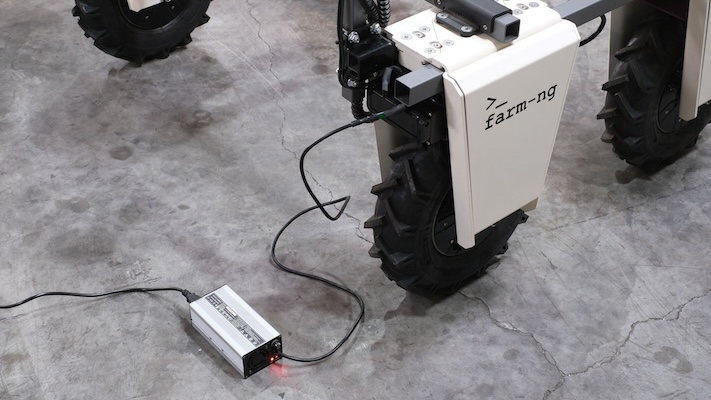

## Charging you Amiga

Each Amiga typically comes with 2 batteries and 2 chargers. Additional batteries and ways to connect extra batteries on the same robot are available at our online shop.

To charge your batteries, remove them from the robot, lift the handle and connect the charger. You will notice the LED in your charging brick will turn RED while the battery is charging and GREEN when done.

:::info
Your charger can output power at 2 A (max), which will charge your 15 Ah in around 6 hours, depending on the buffer you leave (using `batt-lo` parameter on your [dashboard settings](../dashboard/dashboard-user-guide#configuration-settings))
:::

Alternatively, you can use a in-vehicle charging connected directly to your spare Anderson connectors. 

Any 50+ VDC 2+ A charger can be modified to be used as an in-vehicle charging. At Farm-ng we use a 50.4VDC 5A unit that can be purchased at our store. The important is to know that the batteries will charge at max peak voltage of 50.4 VDC, not to be confused with the nominal battery voltage. You can adjust the voltage your dashboard will consider as 100% by setting `batt_hi` at your [dashboard settings](../dashboard/dashboard-user-guide#configuration-settings) (default is 50 V).

:::info
Similar to the standard charger, a 5A charger will charge our battery in around 2.5 hours, depending on the `batt-lo` parameter on your [dashboard settings](../dashboard/dashboard-user-guide#configuration-settings)
:::

:::tip
In order for in-vehicle charging to work, you need to keep your batteries ON (keys parallel to ground).
:::

## Battery Fuses

To protect all circuits in your Amiga, all batteries are equipped with a fuse located on its side close to the power output connector. The fuse must be 30 Amp 6x30mm and we recommend using ceramic. Remove it using a phillips screwdriver.

:::tip pro tip
When you battery is not supplying any voltage to the robot, it's highly likely due to a blown fuse. Test it (for continuity, for example) before proceeding with your troubleshooting.
:::