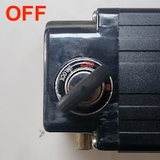
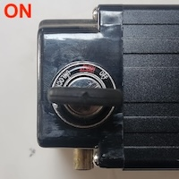
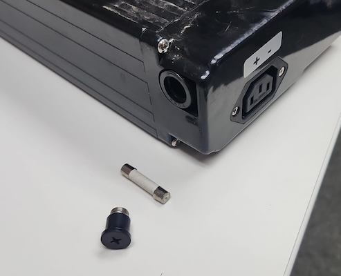
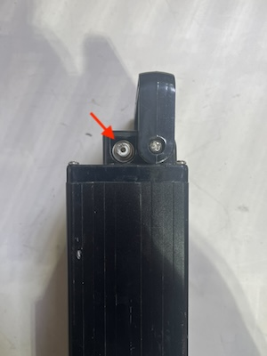
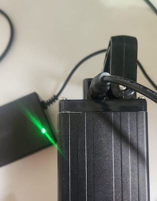

## Batteries

Your Amiga use two batteries, typically inside forks A and B, but it can be changed. Verify at
your Amiga where the battery mount plates are. The specifications for each battery are:

|Parameters| Values|
|---|---|
|Rated capacity | 15 AH |
|Nominal Voltage| 44 V |
|Maximum Charger Voltage | 50.4 V|
|Over-charge voltage protection | 51 V|
|Over-discharge voltage protection|33.6 V|
|Maximum charge current | 30 A |
|Maximum discharge current | 30 A |
|Weight| 5.2 Kg (11.5 Lb)|
|Dimensions|360 x 150 x 68 mm|
|Operation temperature (charging)| 0 ~ 45 C (32 ~ 113 F)|
|Operation temperature (discharging)| -20 ~ 60 C (-4 ~ 140 F) |

Note that operating your batteries consistently close to any maximums and minimum thresholds can
reduce the lifespan of your batteries and ultimately damage the batteries.

### Operation

Each battery contain a key switch on its side. The switch serves dual purpose, locking the battery
on its respective fork and enabling power for the robot. To safely operate your Amiga, you should:

* Slide the battery in using the mounting platform and the grooves located under the battery.
* Insert the key and turn it to the OFF position.
* Connect the C14 power connector on the back of the battery.
* Repeat the first three steps for the other battery
* Turn both batteries ON, powering the Amiga.

 

When connecting batteries in parallel, as in your Amiga configuration, it is required that both
batteries have very similar, if not exactly the same, voltages. The most effective way to achieve
this is by ensuring both batteries are fully charged before connecting them to your Amiga and
keeping them both ON during all operational time.

:::danger Caution
Operating your Amiga with Batteries at different charge levels/voltages lead to high currents moving
from one battery to the other, which can cause permanent damage to the internal cells. With repeated
charge/discharge cycles in these conditions, these damages can build up and increase the risk of a
battery failure.
 
Battery failures are potentially dangerous events that can cause fires that spread fast through
other components of your Amiga and nearby structure. To minimize this risk, **DO NOT** charge or discharge
(operate) batteries with different charge levels/voltages connected together.
:::

Connecting more than 2 batteries at any time increases the likelihood of voltage mismatch. Do not
connect more than two batteries together at any time in your Amiga.

:::tip pro tip
If you are not certain, or cannot enforce the correct usage of your batteries, we recommend using
only one battery at a time.
:::

### Fuses

To protect all circuits in your Amiga, all batteries are equipped with a fuse located on its side
close to the power output connector. The fuse must be 30 Amp, slow blow, and we recommend using
ceramic fuses.
Remove it using a phillips screwdriver.

:::tip pro tip
When you battery is not supplying any voltage to the robot, it is likely due to a blown fuse.
Verify its integrity using a multimeter before you proceed with your troubleshooting process.
:::

## Charging you Amiga

Each Amiga typically comes with 2 batteries and 2 chargers.

To charge your batteries, remove them from the robot, lift the handle and connect the
charger. You will notice the LED in your charging brick will turn RED while the battery is
charging and GREEN when done.

 

Your standard charger can output power at 2 A (max), which will charge a battery for an Amiga in
about 5 hours.

:::caution Battery chargers
**Only use Farm-ng provided chargers.** The use of different chargers can damage the internal
components of your batteries, which can lead to dangerous failures.
:::

Battery charging involves high electric currents and, as any equipment operating at this capacity,
has an electrical risk associated with. When charging your batteries make sure the chargers,
cables, and batteries are in good condition. For additional safety, charge in an open area, away from
flammable materials, structures, and ideally on a concrete floor. This setup minimizes the risk of fire
spreading in the unlikely event of an incident.

If you have any questions or concerns about battery proper charging and handling, please contact our
support team at support@farm-ng.com.
