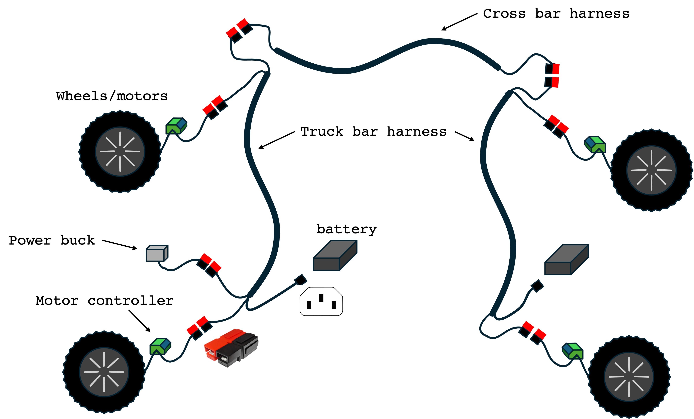
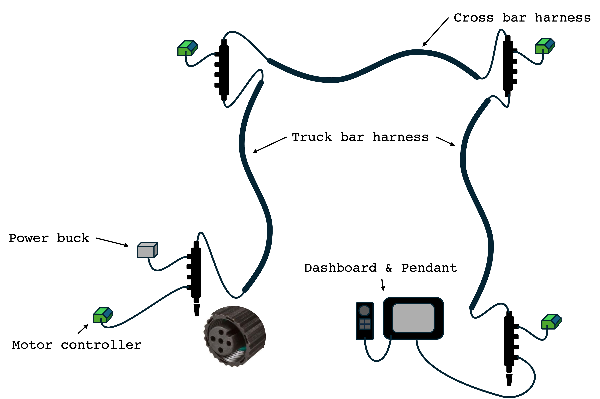
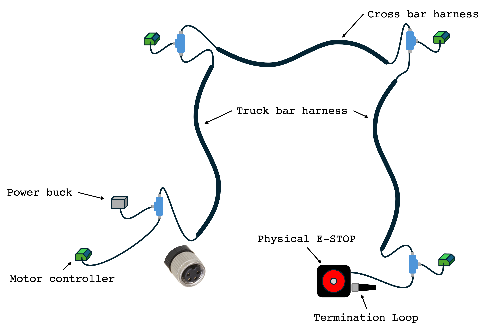

# Amiga's circuits

Your base Amiga is designed for simple assembly and maintenance. It contains three main
circuits essential for operation:

## Power Circuit

This circuit provides power to all other circuits and the motors, operating at 44 VDC (nominal).
Power is drawn from the batteries via IEC C14 connectors and distributed using the cross bar and
truck bar harnesses via Anderson connectors.

We use the motor names to identify the harnesses, the A-D harness is secured
to the truck bars as it is also the case for the B-C harness on the other side. The cross harness
that links the two sides is secured using fir tree fasteners and zip ties.

Each fork also includes an additional Anderson connector for connecting other 44V
accessories.

### Motors

Each wheel in your Amiga contain an electric motor and gear reduction controlled by a controller
placed inside the side panel. Each motor have the following specs:

|Parameters| Values|
|---|---|
|Rated power|250 W|
|Operational Voltage|36 ~ 43 VDC|
|Reduction ratio| 1:30|

Each motor requires its own motor controller and, despite sharing the same hardware, they have
the tires mounted differently. Make sure your motor is adequate to each side of your Amiga when
assembling it.

:::caution
When not powered (including when your physical STOP button is pushed), the motors run freely. Make
sure your are in level ground or have a physical barrier (like a wheel chock) when operating in
slopes.
:::

## CAN Bus

Your Amiga uses a CAN network to send control messages between the dashboard, pendant, motors, and
tools (if available). This network operates at 24 VDC provided by the Power Buck installed in one
of the forks (typically fork B). To prevent current surges on the CAN Bus (and on the ESTOP
circuit), there is a fuse box right out of the Power Buck. It uses 10 Amps automotive fuses.

Inside each fork panel, NMEA-2000 CAN hubs connect provide a connection point to tie the motor
controllers to the CAN network. Extra ports are available to connect additional CAN devices.
Termination resistors are placed at either end of the CAN network to ensure that the CAN signals
are not reflected from the cable ends. For best results, the CAN bus termination should match the
nominal impedance of the cables, which for ISO 11898-2 (high speed CAN) is specified at 120 Ohm.

:::tip pro tip
When you can't detect power on your CAN bus (e.g. Dashboard and Brain won't boot), there is a high
chance you have a blown fuse. Inspect your fuse integrity visually and/or using a multimeter before
proceeding with troubleshooting.
:::

## ESTOP Circuit

The primary role of the E-stop circuit is to cut power from the motor controllers at start up
(preventing any possibility that the Amiga would simply take off) as well as in emergency
situations when the Amiga must be stopped. This circuit also receives 24 VDC from the power buck
and distributes via M8 connectors to the motor controllers, tools, and the physical STOP button.

:::warning ESTOP button at inclined terrain
Engaging the E-stop button cuts power to the motor controllers but it does not provide a braking
system. Be prepared for the Amiga to roll freely if the button is engaged while the robot sits at
an `incline.
:::

Inside each fork panel, blue M8 Tees allow motor controllers to receive the E-STOP signal. The tees
are simply junctions that allow for the creation of a closed loop system across all the peripherals
attached to the E-Stop circuit. Additional components such as the H-bride and PTO must be tied to
the E-stop circuit for safety purposes. This is done by adding t junctions and cables to bring in
these peripherals into the loop.

The STOP button physically opens the circuit. It includes a second
connector for adding more buttons; if not in use, this connector should have a termination loop.
**Without the termination loop the circuit remains open, leaving the robot in
[E-STOP status](../dashboard/control-states#state-descriptions)**.

## Motor Controller

Each motor use a controller that requires all three circuits to operate. The connections for each
circuit are inside the side panels on a custom harness. Removing any of the connections will result
on a CAN and/or E-STOP circuit errors. Refer to [Debugging Error Codes](../dashboard/debugging.md)
section to learn more about errors and solutions.

:::tip Pro tip
When any of the motors have an error, your Amiga will be inoperative until all errors are cleared.
If you are in and unsafe space for debugging, you can disable the faulty motor/controller going to
[Dashboard Settings > Settings > `mXX_on`](../dashboard/dashboard-user-guide#configuration-settings)
and setting to `False`. Note that:

- `m10` = motor A
- `m11` = motor B
- `m12` = motor C
- `m13` = motor D

Revert the motor back to `True` to resume debugging.
:::
