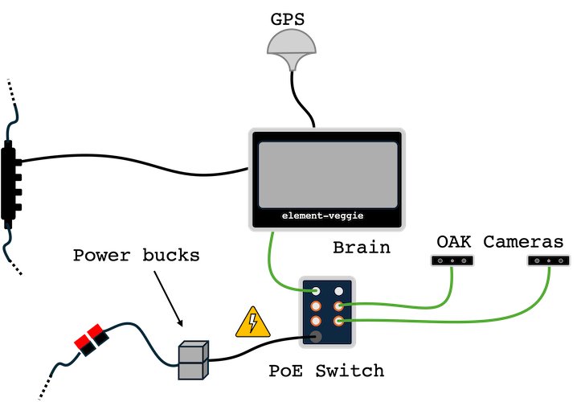

# Farm-ng Brain and accessories

When your Amiga is equipped with a Brain and its typical accessories, you will be able to create applications that interact and record CAN messages and other software services to make your Amiga an autonomous robot. To accomplish that, your Brain must be connected to the CAN bus.

The Brains is usually purchased with the other parts of our Intelligence Kit: cameras, GPS antenna, and a Power over Ethernet (PoE) Switch:

Note that both the Brain and the PoE switch drawn power from the CAN bus (24 VDC), with the switch using 2 power bucks to convert 24 VDC to 48 VDC and maintain redundancy.

:::warning Caution
When changing connections on the PoE and/or Brain, make sure you do not connect the power cable from the PoE (the one leaving the power bucks) to the Brain. **Doing so will cause electrical and/or thermal damage to your Amiga's Brain.**
:::

The open ports on your PoE Switch can be used to add more camera (up to 4 in total) and other ethernet devices  (you will need a NMEA-2000 to Ethernet cable adapter).

Finally, the GPS antenna uses an SMA cable to provide RTK corrections to the Brain.

:::info Changing Intelligence kit mount
When changing where the Intelligence Kit is mounted in your Amiga, make sure you update the Robot Geometry parameters on your [Brain Settings](../apps/launcher/#robot-geometry).