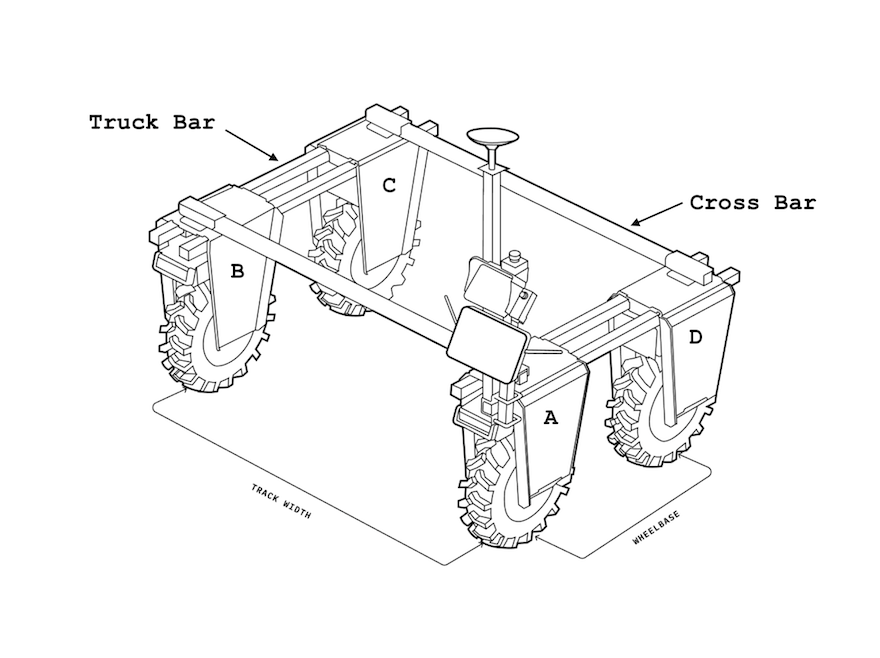
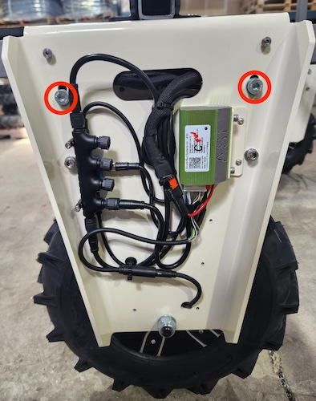
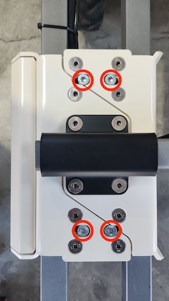

# Amiga's Mechanical Assembly

Your Amiga is a modular platform designed to adapt to different activities and attachments, and we encourage our customers to experiment with different configurations based on their use case. To achieve maximum performance of your Amiga, there are a few design rules you should observe:

* The ratio between your Amiga's length and width should be 0.6 or less.
  * E.g., a 48" wheelbase Amiga should have a track width of approximately `48 * 0.6 ~ 27 inches`.

:::warning Amiga's geometry
Operating with larger ratios will lead to premature overheating of your motors and eventually permanent damage. To reduce this risk, our motors will stop for cooling once they reach 80°C (176°F). This is highly dependent on how your load is configured and the service (turn radius, frequency, type, etc.)
:::
* Note there is a tradeoff here: larger bases are more stable but cause extra effort on the outside wheels when turning.
* Unless otherwise stated, we recommend 23 lb.ft (310 N.m) of torque on all bolts and nuts in your Amiga.

## Length (`wheel_track`)

* To change the wheelbase length, raise your Amiga using a scissor lift or a Farm Jack. Loosen the 7 mm Allen bolts highlighted in the image below (on both sides of the fork). The forks will slide easily.

 

* When tightening them back, make sure the fork tops are parallel to the ground by tightening the bolts evenly. If the inner clamps that keep the Truck Bars locked are uneven, the wheels will not be perpendicular to the ground.

:::warning Amiga's geometry
When you change your Amiga's size, remember to change the `wheel_track` parameter on your [dashboard](../dashboard/dashboard-user-guide#configuration-settings) and your [Brain Settings](../apps/launcher/#robot-geometry) (if applicable).  
**If there is a mismatch between your physical setup and your dashboard configuration, you will likely experience overheating and erratic motor speeds when turning.**
:::
## Width (`track_width`)

* To change the Track Width (or how wide the Amiga is), raise your robot and loosen the Allen bolts on the side of the clamps on top of the forks. The forks on that side will slide easily.
* Make sure you tighten all bolts. Loose bolts will cause your crossbars to wear out and make your Amiga less rigid.
:::info Amiga's Geometry when using Intelligence Kit
If you have an Intelligence Kit, remember to change the `wheelbase` parameter on your [Brain Settings](../apps/launcher/#robot-geometry).  
**If there is a mismatch between your physical setup and your geometry settings in your Brain, you will likely experience offsets when following tracks.**
:::
## Pendant and Intelligence Kit Pole

* You can move the pendant using the existing U-clamps anywhere on your Amiga. If the cables are not long enough, you can change their connections to any of the forks or order extensions from our [online shop](https://farm-ng.com/products/la-maquina-amiga).
* If you move the pendant to the reverse side of the robot, you can use the `flip_joystick` parameter on your [dashboard](../dashboard/dashboard-user-guide#configuration-settings).
:::info Amiga's Geometry when using Intelligence Kit
If you change your Intelligence Kit mount location, remember to change the GPS and IMU offset parameter on your [Brain Settings](../apps/launcher/#robot-geometry).  
**If there is a mismatch between your physical setup and your geometry settings in your Brain, you will likely experience offsets when following tracks.**
:::

