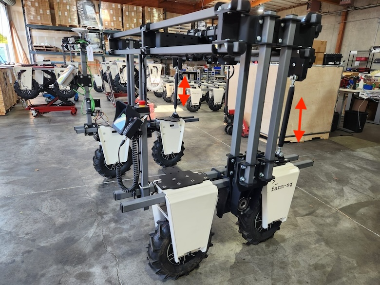

# Suspension kit

When operating on irregular terrain, a rigid Amiga will lose traction if one side is on a ridge, for example. To operate in these conditions, you can replace your Cross Bars with a suspension kit.

You can use the 1.5-inch square tube modular system to configure it to go over produce rows, as shown above, or on beds, keeping the normal Amiga height. Either way, all Base Amiga mechanical principles apply, with extra options for alignment.

Use the support bars marked in the picture to align your suspension kit vertically and horizontally. Make sure you tighten the lock bolts on both ends of each support bar to maintain your geometry.

:::tip Aligning your amiga suspension
When changing payloads in your Amiga, remember to balance your robot using the support bars. A well balanced machine reduces stress on your motors, reduce risks of overheating, and improves your machine life spam.