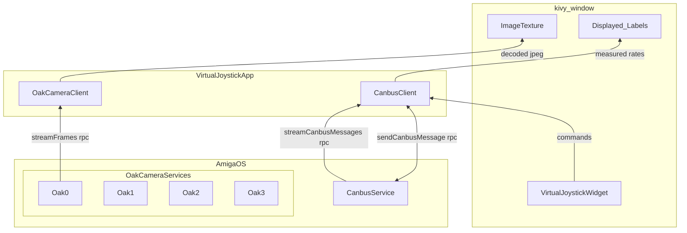

# Virtual Joystick Overview

:::caution deprecation warning
This is out-of-date for brains running `v2.x` Amiga OS software. 
This tutorial only applies to brains running Amiga OS `v1.x` versions. 
Please check back for an updated tutorial for brains running `v2.x` Amiga OS software.
:::

:::tip
This tutorial builds off of the
[**Tutorial Introduction**](/docs/tutorials/introduction/tutorial-introduction) and the
[**Camera Streamer Tutorial**](/docs/tutorials/camera_streamer/camera-streamer-overview),
so please check those out if you have not already.
:::

## [Link to `virtual-joystick`](https://github.com/farm-ng/virtual-joystick-v2)

This example application and tutorial is designed to enable you
to develop your own custom applications and deploy them to the
Amiga brain.
The goal of this tutorial is to take you step-by-step from the
template repository to the full
[**`virtual-joystick`**](https://github.com/farm-ng/virtual-joystick) example.
Then you can mirror what you've done here in your own custom app
development!

On the brain, there are multiple gRPC services running in the
background, including the oak camera service and the canbus
service.
We will teach you how to interact with these two services through
the camera client and canbus client, respectively.
We will also show you how to create a basic kivy application, a
custom kivy widget, and use gRPC and asyncio in that application.

The topics covered in this tutorial include:

- Creating kivy applications
- Custom kivy widgets
- GRPC / asyncio application development
- Streaming an Oak camera with the camera client
- Streaming Amiga state information with the canbus client
- Auto control mode of Amiga robot with the canbus client

:::info
We hope that after completing this tutorial, and the
predecessors, you are prepared to develop your own custom Amiga
brain applications on the Amiga brain.
If you feel we missed any key details, please let us know at
[**discourse.farm-ng.com**](https://discourse.farm-ng.com/) so we
can help you through it and add it to the tutorial for everyone
else to benefit from!
:::

## Block diagram

