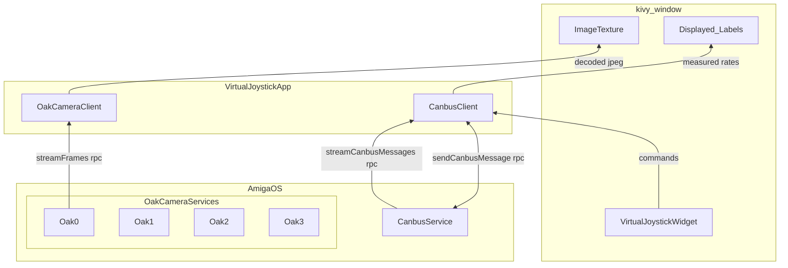

# Virtual Joystick Overview

:::tip
This tutorial builds off of the
[**Tutorial Introduction**](/docs/tutorials/introduction/tutorial-introduction) and the
[**Camera Streamer Tutorial**](/docs/tutorials/camera_streamer/camera-streamer-overview),
so please check those out if you have not already.
:::

## Link to [**`virtual-joystick`**](https://github.com/farm-ng/virtual-joystick-v2)

This tutorial is intended to introduce you to the canbus API. The previous
tutorial demonstrated accessing the camera streams, and this one is
intended to teach you to make the Amiga move! This tutorial builds off
and adjusts the [**`camera-streamer`**](https://github.com/farm-ng/camera-streamer-kivy)
to develop the [**`virtual-joystick`**](https://github.com/farm-ng/virtual-joystick-v2) example.
Then you can mirror what you've done here in your own custom app
development!

This tutorial will walk you through how to interact with these two services through
the camera client and canbus client, respectively.
It will also walk through creating a basic kivy application, and
custom kivy widget but is primarily focused on developing some familiearity with the farm-ng API.

From the previous tutorials the following should feel familiear:

1. Clone and name your custom app repository
2. Build the kivy image widgets
3. Subsrcibe to the oak (camera) service
4. Connect front-end image viewer (kivy) to backend image stream (oak service)

This tutorial will build on the previous and introduce:

1. Importing custom kivy widgets
2. Subscribing to the canbus service
3. Introduce requestReply for sending canbus messages
4. Configuring the setup.cfg and service_config.json file for your own custom apps

:::info
We hope that after completing this tutorial, and the
predecessors, you are prepared to develop your own custom Amiga
brain applications on the Amiga brain.
If you feel we missed any key details, please let us know at
[**discourse.farm-ng.com**](https://discourse.farm-ng.com/) so we
can help you through it and add it to the tutorial for everyone
else to benefit from!
:::

<!--- ## Block diagram -->

